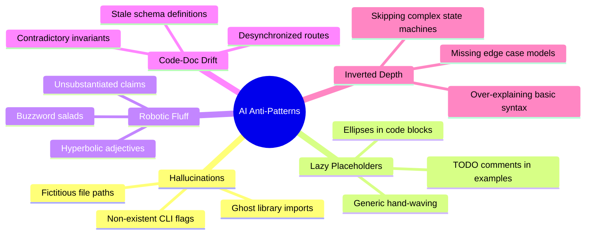

# Rule: AI Coding & Documentation Anti-Patterns Catalog

This rule establishes an explicit, enforceable taxonomy of failure modes common in AI-assisted software engineering. All AI agents and human contributors must eliminate these patterns.

---

## The 10 AI Anti-Patterns & Engineering Remedies



---

### 1. Hallucinated Commands, Flags & Imports
- ❌ **Anti-Pattern:** Generating commands with fabricated flags (e.g. `pnpm test --parallel-max=4`) or importing non-existent packages.
- ✅ **Remedy:** Verify every command, argument, and import against workspace manifest files (`package.json`, `go.mod`, `Cargo.toml`, `pyproject.toml`) and filesystem paths before producing output.

### 2. Lazy Placeholders & Stubbed Code
- ❌ **Anti-Pattern:**
  ```typescript
  // ❌ BAD: Lazy placeholder
  function processTransaction(tx: Transaction) {
    // ... add validation logic
    // TODO: persist to database
    return true;
  }
  ```
- ✅ **Remedy:** Provide complete, runnable, fully typed code blocks handling error paths and edge cases.

### 3. Robotic Buzzwords & Marketing Prose
- ❌ **Anti-Pattern:** _"This module seamlessly leverages game-changing paradigms to empower next-generation synergy."_
- ✅ **Remedy:** Use active voice, factual engineering prose focusing on algorithmic complexity, invariants, data structures, and concrete mechanics.

### 4. Code-Doc Desynchronization (Drift)
- ❌ **Anti-Pattern:** Documenting routes or schemas that do not match the source code verbatim.
- ✅ **Remedy:** Update documentation and code in the **same atomic commit**. Validate route paths and schema types directly against backend routers and ORM models.

### 5. Inverted Technical Depth
- ❌ **Anti-Pattern:** Writing 3 paragraphs explaining basic loop syntax while reducing a complex distributed consensus algorithm or AST DAG traversal to 1 generic sentence.
- ✅ **Remedy:** Calibrate depth to domain complexity. Assume the reader is a competent engineer. Provide deep technical explanations for custom state machines, AST evaluators, and concurrency controls.

### 6. Broken, Hypothetical, or Fake Paths
- ❌ **Anti-Pattern:** Writing fake paths like `file:///path/to/my/project/...` or linking to files that do not exist on disk.
- ✅ **Remedy:** Use verified workspace-relative paths or clickable markdown links pointing to real files.

### 7. Happy-Path Exclusivity
- ❌ **Anti-Pattern:** Documenting only `200 OK` success responses.
- ✅ **Remedy:** Always document validation failures (`422`), authorization errors (`403`), authentication lapse (`401`), rate limits (`429`), and RFC 7807 problem details.

### 8. ASCII Art Boxes & Walls of Text
- ❌ **Anti-Pattern:** Drawing box art with characters (`┌─┐`, `│ │`, `└───┘`) or producing 300 lines of unbroken text.
- ✅ **Remedy:** Use **Mermaid.js** for visual architecture diagrams and **Markdown Tables** for structured data.

### 9. Unpinned Versions & Environmental Ambiguity
- ❌ **Anti-Pattern:** _"Install latest Go and Node."_
- ✅ **Remedy:** Specify exact minimum versions (e.g. `Go 1.23+`, `Node.js 22 LTS`, `pnpm 9+`, `PostgreSQL 18`, `Redis 7.2+`) with verification commands.

### 10. Invariant Contradictions
- ❌ **Anti-Pattern:** Stating different permission or lifecycle invariants across multiple documents.
- ✅ **Remedy:** Maintain a single authoritative permissions matrix and schema reference across the repository.
