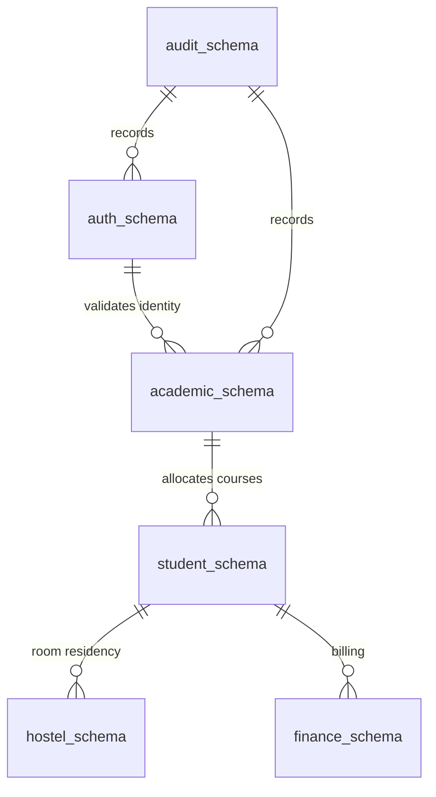

# 03 — Domain Catalog & Schema Boundaries

**Governing Document:** [Campus_OS_Product_Bible_v1.2.docx](file:///home/yogesh/Downloads/Campus_OS_Product_Bible_v1.2.docx)  
**Status:** Canonical

---

## 1. Domain Ownership Model

In accordance with architectural principles:

* Each domain **strictly owns** its PostgreSQL schema.
* No domain may directly query or mutate another domain's database tables.
* Read/write interactions across domains must traverse canonical domain contracts (synchronous operations or asynchronous domain events).

---

## 2. PostgreSQL Schema Inventory & Table Ownership

### 2.1 `auth_schema` (Identity & Access Domain)

* **Domain Owner:** Identity & Access Team / Security Services.
* **Tables:**
  * `users` — Base identity records (UUID, institutional email, phone, hashed credentials, status).
  * `roles` — Predefined institutional roles (`Teacher`, `HOD`, `Warden`, etc.).
  * `permissions` — Atomic system capabilities (`marks.submit`, `outpass.approve`, etc.).
  * `role_permissions` — Mapping of permissions to roles.
  * `role_assignments` — Active and historical role assignments binding persons to roles.
  * `assignment_scopes` — Multi-dimensional scope filters attached to role assignments.
  * `delegations` — Time-bound, auditable role delegations.
  * `super_admin_seat` — Singleton table guaranteeing exactly one active Super Admin seat.

### 2.2 `academic_schema` (Academic Domain)

* **Domain Owner:** Academic Affairs / Office of Dean Academics.
* **Tables:**
  * `departments` — Academic departments (e.g., Computer Science, Mechanical).
  * `courses` — Degree curricula (e.g., B.Tech CSE, M.Tech ECE).
  * `semesters` — Structured curriculum semesters (1 through 8).
  * `subjects` — Modular curriculum units (e.g., Data Structures, Operating Systems).
  * `labs` — Practical laboratory units.
  * `hosted_semesters` — Departmental instances of a course semester for an academic term.
  * `sections` — Cohort sections created within a hosted semester (Section A, B, C).
  * `timetables` — Scheduled class slots, periods, and room mappings.
  * `teaching_assignments` — Mapping of teachers and lab technicians to subjects, sections, and hosted semesters.
  * `internal_assessments` — Assessment definitions (Mid-term, Quizzes, Lab evaluations).
  * `student_marks` — Submitted, reviewed, and finalized student grade records.

### 2.3 `student_schema` (Student Domain)

* **Domain Owner:** Registrar / Student Affairs.
* **Tables:**
  * `student_profiles` — Canonical student demographics, roll number, PRN, registration date.
  * `student_lifecycle_history` — Audited transitions across `APPLICANT`, `ENROLLED`, `ACTIVE`, `SUSPENDED_OR_ON_LEAVE`, `ALUMNI_GRADUATED`, etc.
  * `student_enrollments` — Active course and semester enrollment mappings.
  * `student_section_memberships` — Historical and current section memberships.
  * `student_attendance` — Attendance registers and individual session logs.

### 2.4 `hostel_schema` (Campus Life & Hostel Domain)

* **Domain Owner:** Chief Warden / Hostel Administration.
* **Tables:**
  * `hostels` — Hostel buildings/blocks.
  * `hostel_rooms` — Room inventory, floor level, capacity, amenities.
  * `bed_allocations` — Active and historical student bed assignments.
  * `outpass_requests` — Gate outpass and leave applications.
  * `outpass_approvals` — Warden approval records, comments, and condition codes.
  * `gate_logs` — Guard checkpoint physical departure and arrival timestamps.

### 2.5 `finance_schema` (Finance Domain)

* **Domain Owner:** Accounts & Finance Office.
* **Tables:**
  * `fee_structures` — Master tuition, hostel, and lab fee heads mapped to courses and batches.
  * `student_ledgers` — Individual debit/credit balances per student.
  * `payment_receipts` — Online and offline payment verification records.
  * `fee_concession_requests` — Audited discount and scholarship workflow states.

### 2.6 `document_schema` (Document Domain)

* **Domain Owner:** Central Document Custodian.
* **Tables:**
  * `document_metadata` — Content hashes, MIME types, storage paths, encryption keys.
  * `document_versions` — Immutable version chain of uploaded documents and certificates.
  * `verification_records` — Sign-offs and cryptographic verification marks.

### 2.7 `audit_schema` (Platform Cross-Cutting Domain)

* **Domain Owner:** Independent Platform Governance.
* **Tables:**
  * `audit_logs` — Immutable transactional event log (`who`, `when`, `action`, `target_resource`, `diff`).
  * `decision_records` — Evaluated criteria, policy versions, inputs, and results for rule-based or approval-driven outcomes.
  * `break_glass_incidents` — Developer emergency interventions, affected tables, incident rationale, and freeze state.

---

## 3. Data Integrity & Lifecycle Rules

1. **Soft Deletion Only:** Tables include `retired_at` and `retired_by_id`. No active API endpoint issues `DELETE` statements.
2. **Historical Preservations:** Edits to master or operational data generate a new canonical state while leaving existing rows in the audit chain.
