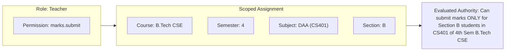

# 04 — Authorization & Access Control Specification

**Governing Document:** [Campus_OS_Product_Bible_v1.2.docx](file:///home/yogesh/Downloads/Campus_OS_Product_Bible_v1.2.docx)  
**Status:** Canonical & Locked

---

## 1. Core Model: Scoped RBAC

Permissions are assigned exclusively to **Roles**, never directly to users. A user exercises permissions solely through active **Role Assignments**.

$$\text{Person} \longrightarrow \text{Role Assignment} \left[\text{Predefined Scope Filters}\right] \longrightarrow \text{Role} \longrightarrow \text{Permissions}$$

### 1.1 Multi-Role & Additive Authority
* A user may hold multiple active roles simultaneously (e.g. `Teacher` and `Warden`).
* Authorizations are strictly **additive** across active assignments.
* Assignments are independent; there are no complex boolean OR expressions across distinct assignments.

---

## 2. Multi-Dimensional Scopes & AND Semantics

A scope filter does not create new permissions; it bounds where an existing role permission can be exercised. When multiple dimensions are attached to an assignment, they combine with strict **AND** semantics.

### 2.1 Predefined Scope Dimensions
1. `DepartmentId`
2. `CourseId`
3. `SemesterId`
4. `SectionId`
5. `SubjectId`
6. `LabId`
7. `HostelBlockFloorId`

---

## 3. Privacy & Visibility Classifications

Campus OS enforces a **Strict Need-to-Know** access boundary:

| Persona | Data Visibility Boundary |
| :--- | :--- |
| **Student** | Full access to own profile, attendance, grades, ledger balance, and outpass requests. **Zero visibility** into peer individual grades or disciplinary records. |
| **Teacher** | Read/write access strictly bounded to students enrolled in their assigned subjects, sections, and lab slots. No access to other sections or unassigned subjects. |
| **HOD** | Comprehensive visibility across all programs, courses, hosted semesters, faculty, and students within their academic department. |
| **Warden** | Full visibility over hostel residents, bed occupancy, room maintenance, and leave/outpass workflows within their hostel block. |
| **Guard** | Real-time visibility limited strictly to approved outpasses for checkpoint identity verification and timestamp logging. |
| **Registrar / Dean** | Institution-wide read visibility for academic records, admissions, enrollments, and institutional governance. |
| **Management / Moderator** | Institutional oversight visibility across grievance logs, operational reports, and cross-departmental escalations. |

---

## 4. Role Governance & Lifecycle

* **Assignment Workflows:** Adding or delisting a role assignment requires an authorized administrative workflow. Direct database toggles are prohibited.
* **No Silent Expiry:** Role assignments do not automatically expire at the end of an academic semester. Delisting requires an explicit, audited revocation workflow.
* **Auditable Delegation:** Temporary delegation of an approval power is time-bound, audited, and cannot elevate the delegate's underlying role permissions beyond the delegated task.

---

## 5. Super Admin Governance

* **Singleton Principle:** Exactly **one** active Super Admin seat exists at any point in time.
* **Atomic Succession:** Succession occurs via an atomic database transaction where the incumbent seat is retired and the successor is crowned simultaneously.
* **Separation from Developer:** The Super Admin is an institutional administrator and cannot invoke Developer-exclusive capabilities (such as break-glass emergency procedures).
