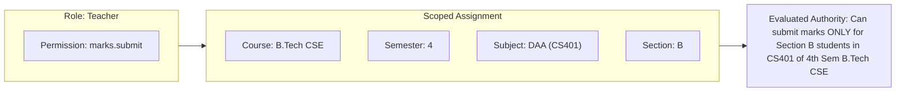

# 04 — Authorization & Access Control Specification

**Governing Document:** [Campus_OS_Product_Bible_v1.2.docx](file:///home/yogesh/Downloads/Campus_OS_Product_Bible_v1.2.docx)  
**Status:** Canonical & Locked

---

## 1. Core Model: Scoped RBAC

Permissions are assigned exclusively to **Roles**, never directly to users. A user exercises permissions solely through active **Role Assignments**.

$$\text{Person} \longrightarrow \text{Role Assignment} \left[\text{Predefined Scope Filters}\right] \longrightarrow \text{Role} \longrightarrow \text{Permissions}$$

### 1.1 Multi-Role & Additive Authority

* A user may hold multiple active roles simultaneously (e.g. `Teacher` and `Warden`).
* Authorizations are strictly **additive** across active assignments.
* Assignments are independent; there are no complex boolean OR expressions across distinct assignments.

---

## 2. Multi-Dimensional Scopes & AND Semantics

A scope filter does not create new permissions; it bounds where an existing role permission can be exercised. When multiple dimensions are attached to an assignment, they combine with strict **AND** semantics.

### 2.1 Predefined Scope Dimensions

1. `DepartmentId`
2. `CourseId`
3. `SemesterId`
4. `SectionId`
5. `SubjectId`
6. `LabId`
7. `HostelBlockFloorId`

---

## 3. Privacy & Visibility Classifications

Campus OS enforces a **Strict Need-to-Know** access boundary:

| Persona | Data Visibility Boundary |
| :--- | :--- |
| **Student** | Full access to own profile, attendance, grades, ledger balance, and outpass requests. **Zero visibility** into peer individual grades or disciplinary records. |
| **Teacher** | Read/write access strictly bounded to students enrolled in their assigned subjects, sections, and lab slots. No access to other sections or unassigned subjects. |
| **HOD** | Comprehensive visibility across all programs, courses, hosted semesters, faculty, and students within their academic department. |
| **Warden** | Full visibility over hostel residents, bed occupancy, room maintenance, and leave/outpass workflows within their hostel block. |
| **Guard** | Real-time visibility limited strictly to approved outpasses for checkpoint identity verification and timestamp logging. |
| **Registrar / Dean** | Institution-wide read visibility for academic records, admissions, enrollments, and institutional governance. |
| **Management / Moderator** | Institutional oversight visibility across grievance logs, operational reports, and cross-departmental escalations. |

---

## 4. Role Governance & Lifecycle

* **Assignment Workflows:** Adding or delisting a role assignment requires an authorized administrative workflow. Direct database toggles are prohibited.
* **No Silent Expiry:** Role assignments do not automatically expire at the end of an academic semester. Delisting requires an explicit, audited revocation workflow.
* **Auditable Delegation:** Temporary delegation of an approval power is time-bound, audited, and cannot elevate the delegate's underlying role permissions beyond the delegated task.

---

## 5. Super Admin Governance

* **Singleton Principle:** Exactly **one** active Super Admin seat exists at any point in time.
* **Atomic Succession:** Succession occurs via an atomic database transaction where the incumbent seat is retired and the successor is crowned simultaneously.
* **Separation from Developer:** The Super Admin is an institutional administrator and cannot invoke Developer-exclusive capabilities (such as break-glass emergency procedures).

---

## 6. Canonical Identity & Onboarding Architecture

### 6.1 Student Username Convention (Option A)
$$\mathbf{\left[\text{first}\right]} \boldsymbol{.} \mathbf{\left[\text{course}\right]} \boldsymbol{.} \mathbf{\left[\text{YYYY}\right]} \left[\boldsymbol{.} \mathbf{\text{l}}\right] \left[\boldsymbol{.} \mathbf{\text{increment}}\right]$$

* Regular Student: `yogesh.cse.2024` $\rightarrow$ Collision: `yogesh.cse.2024.1`
* Lateral Entry: `yogesh.cse.2024.l` $\rightarrow$ Collision: `yogesh.cse.2024.l.1`
* Official Email: `<username>@campus.edu`

### 6.2 Faculty & Staff Username Convention
$$\mathbf{\left[\text{first}\right]} \boldsymbol{.} \mathbf{\left[\text{last}\right]} \boldsymbol{.} \mathbf{\left[\text{YYYY}\right]} \left[\boldsymbol{.} \mathbf{\text{increment}}\right]$$

* Example: `amit.sharma.2026` $\rightarrow$ Collision: `amit.sharma.2026.1`
* Official Email: `<username>@campus.edu`

### 6.3 Onboarding & Authentication Invariants
* **No Public Self-Registration:** All identities are pre-provisioned via Admissions or HR.
* **Zero-Faculty-Knowledge QR Delivery:** Student initial credentials/claim tokens are delivered via sealed, tamper-evident QR codes on admission slips. Faculty and department staff never see or handle student initial passwords.
* **First-Scan Mandatory Password Reset:** Scanning the onboarding QR prompts the user to immediately set their personal password before accessing any institutional data.
* **3-Day Grace Period:** During the initial 72 hours, users may set a simplified password (minimum 6 characters). After 3 days, enterprise password complexity (10+ characters, mixed case, numbers, symbols) is strictly enforced.
* **Faculty MFA:** Mandatory TOTP Multi-Factor Authentication enrolled during invitation activation.
* **Session Lifecycle:** 15-minute JWT Access Tokens paired with 7-day HttpOnly Refresh Tokens enforcing automatic Family Token rotation breach detection.

### 6.4 Bulk Credential Generation Authority Matrix
Bulk credential generation and QR printing are strictly segregated administrative operations governed by Scoped RBAC. General teaching faculty and staff have zero authority to generate student or peer QR credentials:

| Target Cohort | Authorized Generation Role | Permission Code | Mandatory Prerequisite |
| :--- | :--- | :--- | :--- |
| **Students (UG, PG, Lateral)** | **Registrar / Admissions Office** | `admissions.qr.generate_bulk` | Approved gazetted admission roll with verified phone & email |
| **Faculty & Academic Staff** | **Human Resources (HR) / Dean** | `hr.faculty_qr.generate_bulk` | Executed appointment orders & personnel file |
| **Operational Staff (Guards, Estate)** | **Chief Security Officer (CSO) / Estate** | `staff.qr.generate_bulk` | Background check clearance & operational roster |

* **Immutable Batch Manifest:** Each bulk QR generation action is recorded in `audit.qr_batch_manifest` containing `batch_id`, operator `user_id`, cohort type, target record count, cryptographic checksum, timestamp, and print station terminal ID.

### 6.5 Hardware SIM-Binding & Mobile Number Verification
* **SIM Telephony Presence Check:** Onboarding QR claim requires the Campus OS native mobile client to verify that the device hardware contains the active SIM matching the phone number registered during admissions.
* **Mobile OTP Handshake:** A single-use cryptographic token dispatched via SMS must be verified directly on the device hosting the SIM.
* **Physical Theft Defense:** Possession of the physical QR paper slip alone is insufficient to claim an account; any claim attempt on a device lacking the registered SIM is blocked (`ERR_SIM_ABSENT_OR_MISMATCH`).
* **Post-Onboarding Mobile Updates:** Users may update their contact phone number post-onboarding via authenticated self-service requiring step-up re-authentication and Dual-OTP verification (OTP to both old and new numbers), or via Registrar/HR biometric verification if the old SIM is lost.

### 6.6 Dual-Identity & Alt-Name Discrepancy Governance
To resolve persistent discrepancies between Indian secondary school examination records (Class X / Matriculation) and statutory government identification (Aadhaar, Passport, PAN):
* **Tri-Name Separation:** `StudentProfile` distinctly maintains `academicName` (verbatim from 10th marksheet / university roll, e.g. `Yogesh`), `legalFullName` (statutory identity from photo ID, e.g. `Yogesh Kumar Mallik`), and `preferredName` (display name).
* **Canonical Username Anchor:** The canonical username `[first]` token is strictly extracted from `academicName` (e.g. `yogesh`), maintaining synchronization with exam rolls and attendance rosters.
* **Parent & Guardian Alt-Names:** `StudentProfile` maintains decoupled academic and legal names for Father (`fatherAcademicName` vs `fatherLegalName`), Mother (`motherAcademicName` vs `motherLegalName`), and Legal Guardian (`guardianAcademicName` vs `guardianLegalName`).
* **Document Routing Policy:**
  * Academic artifacts (Markcards, Degree Certificates, Transcripts, Hall Tickets) consume `academicName` and parental academic names.
  * Statutory artifacts (DBT/Scholarships, Bank Loan Letters, Placement/Corporate KYC, Visa/Passport Bonafide, Legal Notices) consume `legalFullName` and parental legal names.
* **Dual-Identity Certification:** A standardized institutional certificate (`DOC_CERT_DUAL_IDENTITY`) certifies that the legal name and academic name belong to one and the same individual, backed by an evidentiary affidavit link (`hasNameDiscrepancy` and `nameDiscrepancyAffidavitDocId`).
