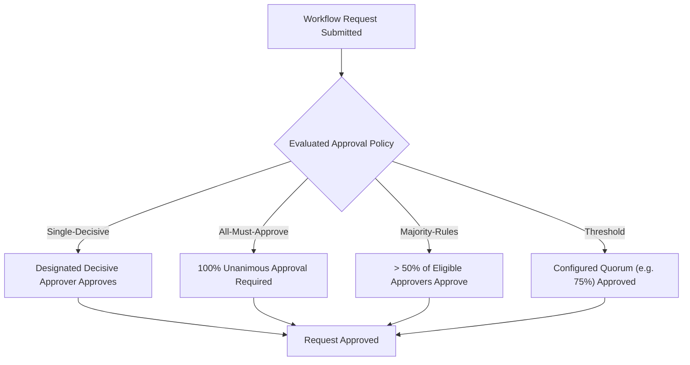
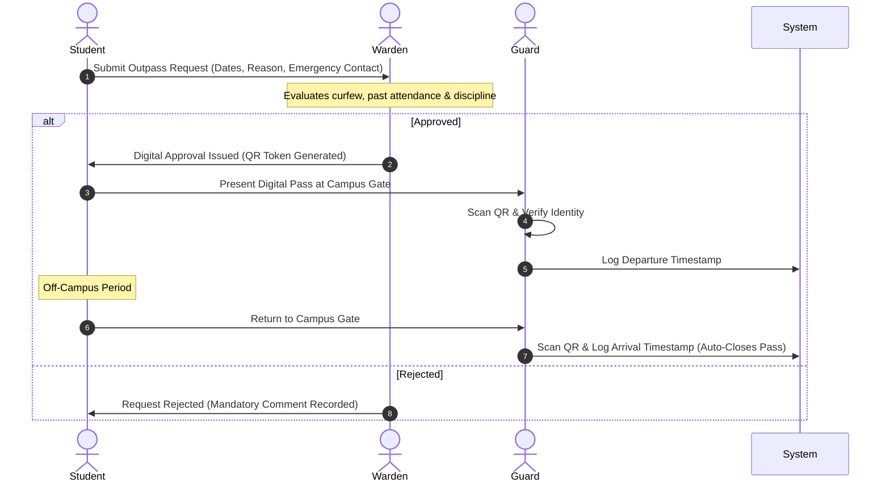
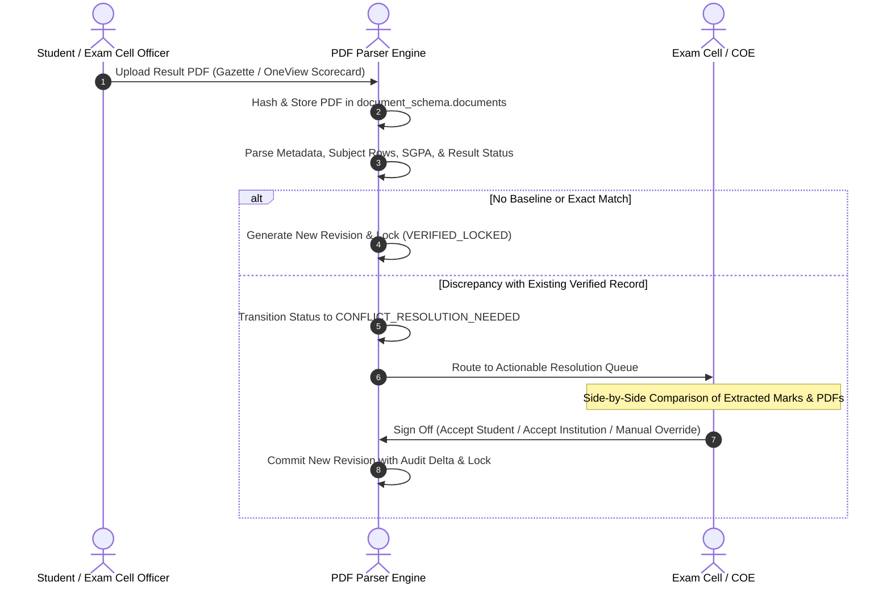

# 05 — Workflow & Approval Specification

**Governing Document:** [Campus_OS_Product_Bible_v1.2.docx](file:///home/yogesh/Downloads/Campus_OS_Product_Bible_v1.2.docx)  
**Status:** Canonical & Locked

---

## 1. Workflow Engine Principles

1. **Versioned Definitions:** Every workflow blueprint is versioned.
2. **In-Flight Immutability:** Requests already in progress remain bound to the workflow version with which they started; subsequent updates to a workflow definition apply solely to new requests.
3. **No Direct Overrides:** Automated rule-based outcomes cannot be overwritten directly. Exceptions must execute through a designated policy-exception workflow.
4. **Submitted Decision Immutability:** An approver may revise a draft decision freely, but once formally submitted, the decision is immutable.

---

## 2. Predefined Approval Policies

Administrators choose from standard, system-provided policy presets rather than constructing custom combinations:

### 2.1 Presets Catalog

1. **Single-Decisive:** Exactly one designated role holds final authority. Additional participants provide advisory input.
2. **All-Must-Approve (Unanimous):** Every participant in the approval chain must vote in favor. A single rejection terminates or returns the workflow.
3. **Majority-Rules (>50%):** Requires more than half of the eligible committee votes.
4. **Quorum / Threshold:** Requires a predefined quorum percentage (e.g. 75%) of assigned members.

---

## 3. Workflow Interaction Rules

* **Mandatory Rejection Comment:** Rejection requires a mandatory documented reason. Approval comments are optional.
* **Backward-Only Information Requests:** An approver may request clarifications only backwards along the existing approval path to previous participants.
* **One-Time Veto / Return:** An approver may return a request to an earlier stage exactly once while the final criteria remain unmet. Once the final approval criteria are satisfied, the request is closed and dissenters cannot reopen it via the veto mechanism.

---

## 4. Phase 1 Core Workflow Scenarios

### 4.1 Hostel Leave & Gate Outpass

### 4.2 Academic Marks & Assessment Finalization

$$\text{Teacher Submits Marks} \longrightarrow \text{HOD Departmental Review} \longrightarrow \text{Registrar / Dean Verification} \longrightarrow \text{Academic Records Locked}$$

### 4.3 Affiliating University (AKTU) Semester Result Ingestion & Conflict Resolution

### 4.4 Master Data Governance Pipeline

$$\text{Registrar / Dean Academics Proposes} \longrightarrow \text{Director Formally Approves} \longrightarrow \text{Super Admin Atomically Commits}$$

---

## 5. Audit Records vs. Decision Records

| Dimension | Audit Record (`audit_schema`) | Decision Record (`audit_schema`) |
| :--- | :--- | :--- |
| **Primary Question** | *What happened?* | *Why was this decision reached?* |
| **Trigger** | Every state-modifying transactional mutation. | Every rule-based or human approval evaluation. |
| **Data Captured** | Actor ID, timestamp, entity changed, previous state, new state, client IP. | Evaluated policy version, input attributes, criteria satisfied/failed, voting breakdown, rationale. |
| **Immutability** | Cryptographically append-only; zero updates/deletions. | Cryptographically append-only; zero updates/deletions. |
