# 06 — Data Governance & Emergency Protocol

**Governing Document:** [Campus_OS_Product_Bible_v1.2.docx](file:///home/yogesh/Downloads/Campus_OS_Product_Bible_v1.2.docx)  
**Status:** Canonical & Locked

---

## 1. Data Classification

Data within Campus OS is categorized into three tiers with distinct governance boundaries:

| Category | Description | Examples | Governance Rules |
| :--- | :--- | :--- | :--- |
| **Master Data** | Canonical institutional entities. | Departments, Courses, Semesters, Subjects, Hostels, Academic Years. | Highly controlled; changes require Registrar/Dean proposal, Director approval, and Super Admin commit. |
| **Operational Data** | Dynamic data produced by domain workflows. | Student attendance, outpasses, internal marks, fee payments. | Created and transitioned through domain state machines; soft-deleted only. |
| **Reference Data** | Centrally defined lookup standards. | ISO country codes, document MIME types, grade scale tables, status enums. | Managed via system configuration; changes require versioned rollout. |

---

## 2. Canonical Records & Correction Principles

1. **Current Canonical Truth:** The current corrected record represents the institutional truth.
2. **Historical Lineage:** Previous values remain preserved in audit history; they are not presented as competing current states.
3. **Audit Context:** Corrections capture `who`, `when`, `why`, and required supporting evidence tokens.
4. **Transition Rules:** Records referencing altered master data must specify an explicit migration or continuity strategy.

---

## 3. Data Migration & Discrepancy Resolution

* **Clean Launch:** Production rollout begins with sanitized, clean new data.
* **Controlled Backfill:** Historical data is backfilled after normalization, deduplication, and validation.
* **No Silent Discrepancy Resolution:** Conflicts or ambiguities encountered during ingestion or operation are flagged as discrepancies rather than silently coerced.
* **Audited Reassignment:** A discrepancy assigned to an authority can be reassigned across domains if misallocated, with each reassignment step recorded in audit history.

---

## 4. Developer Break-Glass Emergency Governance

Emergency access bypasses standard workflow boundaries to address catastrophic outages or corruption. It is governed by strict constitutional rules:

```mermaid
stateDiagram-v2
    [*] --> Normal_Operation
    Normal_Operation --> Break_Glass_Active: Developer invokes CLI with Private Key & Reason
    note right of Break_Glass_Active: Emits immutable cryptographic log; normal validations bypassed
    Break_Glass_Active --> Freeze_State: Developer explicitly terminates session
    note right of Freeze_State: Affected records frozen in read-only mode for institutional users
    Freeze_State --> Normal_Operation: Formal Post-Incident Review & Super Admin/Developer Sign-off
```

### 4.1 Invocation Protocol
* **Sole Authority:** Exclusive to Developer authority. Neither Super Admin nor institutional leadership can invoke break-glass.
* **Tooling:** Invoked via the secure CLI: `campus-os-admin break-glass --key <developer.key> --reason "<rationale>"`.
* **Instant Audit Entry:** Automatically writes an unalterable incident record to `audit_schema.break_glass_incidents`.

### 4.2 Lifecycle & Post-Incident Freeze
* **Explicit Termination Only:** The emergency session has no automatic timeout; it remains active until the Developer explicitly terminates it.
* **Post-Break-Glass Freeze:** Immediately upon termination, all tables and records modified during the session are marked with a freeze flag, restricting institutional users to read-only access.
* **Mandatory Post-Incident Review (PIR):** A formal PIR document must be recorded detailing root cause, actions taken, and verification evidence prior to releasing the freeze.
