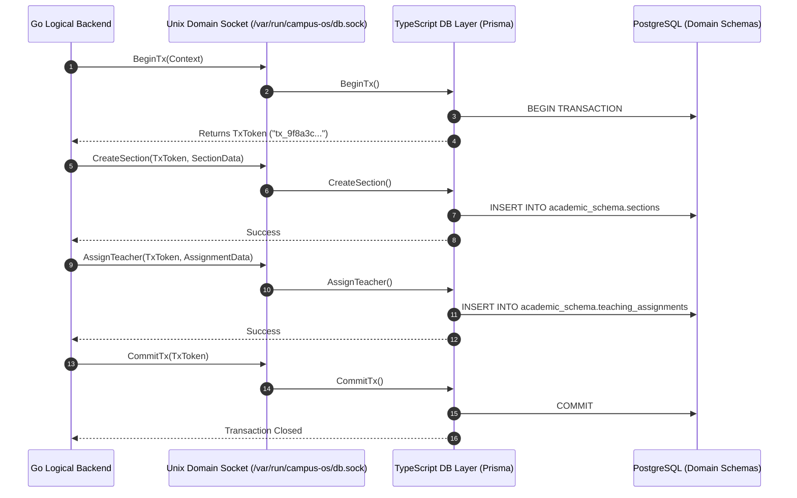

# 07 — API & IPC Contracts Specification

**Governing Document:** [Campus_OS_Product_Bible_v1.2.docx](file:///home/yogesh/Downloads/Campus_OS_Product_Bible_v1.2.docx)  
**Status:** Canonical & Locked

---

## 1. Inter-Process Communication (IPC) Boundary

The architectural boundary separating the Go Logical Backend from the TypeScript Persistence Layer is implemented via **gRPC over a local Unix Domain Socket (UDS)**.



---

## 2. Monorepo Contract Toolchain (`buf`)

* **Single Source of Truth:** All service definitions, messages, and RPCs reside in a centralized `/proto` directory in the monorepo.
* **Code Generation:** Governed via `buf.gen.yaml`:
  * Generates Go server interfaces and client stubs into `/backend/pkg/proto/v1/`.
  * Generates TypeScript server handlers and typed contracts into `/db-layer/src/proto/v1/`.

---

## 3. Atomic Cross-Domain Transactions (`TxToken`)

To satisfy the locked requirement for explicit cross-domain transactions without allowing unrestricted generic CRUD:

1. **Transaction Lifecycle:**
   * Go backend initiates an atomic unit by calling `BeginTx`.
   * The TypeScript persistence layer instantiates a Prisma interactive transaction and registers a short-lived `TxToken` in memory.
   * Subsequent gRPC calls pass `TxToken` in the gRPC call metadata header (`x-tx-token`).
   * The TypeScript layer associates incoming calls with the active Prisma transaction instance.
   * Go terminates the unit via `CommitTx` or `RollbackTx`.
2. **Safety & Timeout Reclamation:**
   * If a `TxToken` exceeds its configured timeout (e.g. 5 seconds) without a commit, the TypeScript layer automatically rolls back the PostgreSQL transaction and discards the token.
   * On Go client disconnection, dangling transactions are aborted immediately.

---

## 4. Deployment Topology & Docker Compose

```yaml
version: "3.8"

services:
  campus-db:
    image: postgres:16-alpine
    environment:
      POSTGRES_DB: campus_os
      POSTGRES_USER: campus_admin
      POSTGRES_PASSWORD_FILE: /run/secrets/db_password
    volumes:
      - pgdata:/var/lib/postgresql/data
    networks:
      - internal-net

  campus-db-layer:
    build:
      context: .
      dockerfile: ./db-layer/Dockerfile
    volumes:
      - socket-volume:/var/run/campus-os
    depends_on:
      - campus-db
    networks:
      - internal-net

  campus-backend:
    build:
      context: .
      dockerfile: ./backend/Dockerfile
    volumes:
      - socket-volume:/var/run/campus-os
    depends_on:
      - campus-db-layer
    networks:
      - internal-net

volumes:
  pgdata:
  socket-volume:

networks:
  internal-net:
```

---

## 5. Observability Stack Integration

* **OpenTelemetry (OTel):** Both Go backend and TypeScript DB service propagate W3C Trace Context across gRPC calls and HTTP client requests.
* **Prometheus:** Exposes scrapable metrics for gRPC latency, active `TxToken` sessions, request throughput, and database connection pool utilization.
* **Grafana:** Pre-packaged dashboards visualizing domain throughput, slow queries, and active workflows.
* **Loki:** Centralized aggregation for structured JSON logs tagged with `request_id`, `actor_id`, and `domain`.

---

## 6. IPC Boundary Isolation & Error Sanitization

To preserve security and system encapsulation, internal details of the IPC boundary must never leak through the external HTTP API or to end users:

1. **UDS Path Concealment:** Internal domain socket paths (e.g., `/tmp/campus-os-dev.sock` or `/var/run/campus-os/db.sock`) must **never** appear in HTTP response bodies, error messages, or logs delivered to clients.
2. **gRPC-to-HTTP Status Code Mapping (`mapGRPCError`):**
   * `codes.Unavailable` & socket dialing failures $\rightarrow$ HTTP `503 Service Unavailable` (`SERVICE_UNAVAILABLE`: "Database Persistence Offline").
   * `codes.DeadlineExceeded` $\rightarrow$ HTTP `504 Gateway Timeout` (`PERSISTENCE_TIMEOUT`: "Database Request Timeout").
   * `codes.NotFound` $\rightarrow$ HTTP `404 Not Found` (`NOT_FOUND`).
   * `codes.AlreadyExists` $\rightarrow$ HTTP `409 Conflict` (`ALREADY_EXISTS`).
   * `codes.PermissionDenied` $\rightarrow$ HTTP `403 Forbidden` (`PERMISSION_DENIED`).
   * `codes.Unauthenticated` $\rightarrow$ HTTP `401 Unauthorized` (`UNAUTHENTICATED`).
   * `codes.InvalidArgument` $\rightarrow$ HTTP `400 Bad Request` (`INVALID_ARGUMENT`).
3. **Client-Side Resiliency:** The client intercepts `503` / `SERVICE_UNAVAILABLE` responses (`IsPersistenceUnavailable`), displaying clear, actionable messages ("Database persistence service is unavailable. Please verify the persistence daemon is running.") rather than raw transport stack traces.
