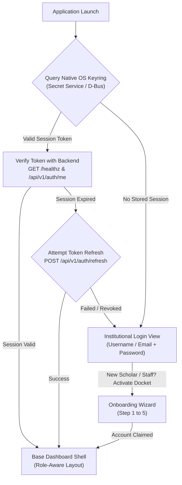

# 10 — Super Admin Creation & Base Dashboard Architecture

**Governing Document:** [Campus_OS_Product_Bible_v1.2.docx](file:///home/yogesh/Downloads/Campus_OS_Product_Bible_v1.2.docx)  
**Status:** Canonical & Locked  
**Aligned In:** Q&A Alignment Session (2026-09-21)  
**Related ADR:** [ADR-0007](file:///home/yogesh/campus_os/docs/adrs/ADR-0007-super-admin-and-dashboard-shell.md)

---

## 1. Executive Summary & Core Premise

Campus OS operates under an absolute single-tenant institutional governance model. This document details:

1. The **Genesis Super Admin (Chairperson)** provisioning lifecycle, delivery mechanism, and hardware binding.
2. The **Client Entrypoint & Smart Session Routing** state machine using native Linux OS Keyring (Secret Service / D-Bus).
3. The **Base Frontend Dashboard Shell (Design System 2026)** with fixed desktop sidebar, responsive drawer, top navigation bar, and executive overview panels.

---

## 2. Genesis Super Admin Provisioning Flow

### 2.1 Server-Side Initialization

* **Execution Boundary:** Bare-metal CLI strictly executed on the host server via SSH/physical access:

  ```bash
  campus-server bootstrap-superadmin --name="Yogesh Kumar Mallik" --email="chairperson@campus.edu" --phone="+919876543210"
  ```

* **Singleton Constraint:** Enforced in the persistence layer via the `SuperAdminSeat` table. If an active, unretired seat already exists, execution fails with status `ALREADY_EXISTS`.
* **Output Artifacts:**
  1. Terminal ASCII QR matrix and raw claim token for direct terminal scanning.
  2. High-resolution exportable QR docket file on disk (`genesis_docket.png` / `.svg`) formatted for printing and physical tamper-evident envelope sealing.

### 2.2 Activation & Telephony Binding

1. The Chairperson launches the Campus OS Native Client.
2. Scans the printed docket or selects the exported image file in Step 1.
3. **Strict Hardware Telephony Match:** The Chairperson’s mobile/desktop handset must verify the registered telephony SIM (`+919876543210`) in Slot 1. Carrier mismatch rejects activation with `403 Forbidden`.
4. **Password Setup:** The Chairperson creates their master passphrase using the standard unified credential setup flow (without forcing mandatory immediate TOTP 2FA).
5. The backend crowns the `SuperAdminSeat`, issues institutional JWT tokens (`SUPER_ADMIN` role), and routes the Chairperson directly into the Executive Dashboard.

---

## 3. Client Entrypoint & Smart Session Routing

### 3.1 Smart Routing State Machine



### 3.2 Keyring & Secure Dual-Revocation

* **Storage:** Native Linux OS Keyring via Secret Service API / D-Bus (`org.freedesktop.secrets`). Stored credentials:
  * `access_token`
  * `refresh_token`
  * `user_id`, `username`, `role_code`
* **Dual-Revocation Logout:**
  1. Clear in-memory session and active canvas widgets.
  2. Delete stored secret keys from the OS Keyring.
  3. Dispatch `POST /api/v1/auth/revoke` to the backend to invalidate the server-side refresh token family.
  4. Reset window content back to the Institutional Login view.

---

## 4. Base Frontend Dashboard Shell Layout (Design System 2026)

### 4.1 Top Navigation Bar Layout

```
+----------------------------------------------------------------------------------------------------+
| [=]  [BBDIT LOGO]            EXECUTIVE OVERVIEW           [Theme 🌓]  [● Live]  [Yogesh (SUPER_ADMIN)] [🚪 Log Out] |
+----------------------------------------------------------------------------------------------------+
```

* **Left:**
  * Hamburger menu icon (visible on compact/mobile screens to toggle sidebar drawer).
  * BBDIT institutional vector header logo.
* **Center:**
  * Current Page Title (e.g., `EXECUTIVE OVERVIEW`, bold uppercase tracking).
* **Right:**
  * Theme toggle (Dark / Light mode).
  * Live backend heartbeat ping indicator (`● Live / Offline`).
  * Active profile pill displaying Full Name and role badge (`SUPER ADMIN`).
  * Logout action trigger.

#### 4.2 Sidebar Navigation (Super Admin / Chairperson)

* **Desktop Geometry:** Fixed width of `220px` with vertical divider.
* **Compact / Mobile Geometry:** Slides out as a left-docked animated drawer when the hamburger icon is tapped.
* **Mobile Drawer Accessibility:**
  * Docked to the left screen edge (no centered floating).
  * Darkened semi-transparent backdrop overlay (`#00000088`).
  * Dismissible via clicking the backdrop or pressing the `Escape` key.
* **Navigation Items:**
  1. **Executive Overview** (`LucideLayoutDashboard`): High-level stats, institutional pulse, quick queues.
  2. **Academic Structure** (`LucideGraduationCap`): Faculties, Departments, Courses, Curriculums, Semesters.
  3. **Governance & Approvals** (`LucideGitPullRequest`): Presidential sign-offs, policy threshold votes, escalations.
  4. **Audit Ledger** (`LucideShieldCheck`): Immutable cryptographic log of enrollments, outpasses, mark changes.
  5. **Executive Credentialing** (`LucideKeyRound` / `LucideQrCode`): Provision sealed access QR tokens for Dean, Registrar, Director, and Executive Director.

### 4.3 Accessible Modal Overlay Architecture (`ShowModal`)

* **Universal Dialog Wrapper:** Standardizes all alert, confirmation, camera, and overflow action dialogs.
* **Dismissal Ergonomics:**
  * `CloseOnEsc`: Enabled by default; listening on window keyboard events.
  * `CloseOnBackdropClick`: Enabled by default; tapping the scrim closes the dialog.
  * Can be deliberately disabled for mandatory wizard steps.
* **Responsive Width Clamping:** Automatically scales dialog container width between `min(screenWidth - 32px, 560px)` to avoid clipping on mobile devices.

---

## 5. Executive Overview Workspace

Below the TopBar and inside the main canvas, the **Executive Overview** presents:

### 5.1 The 4 Primary Executive KPI Cards

Responsive multi-column luminous glass card grid with dynamic wrapping (`AdaptiveGridLayout` / `FlowLayout`) and `TextWrapWord` subtitles:

1. **Total Scholars:** e.g., `1,420 Enrolled` (`98.4% Active Status`)
2. **Academic Departments:** e.g., `8 Active` (`34 Hosted Semesters`)
3. **Pending Presidential Approvals:** e.g., `3 Requiring Chairperson Signature`
4. **Total Staff & Faculty:** e.g., `142 Active Officers & Educators`

### 5.2 Content Panels & Quick Actions

* **Panel 1 (Left): Pending Executive Approvals Queue**
  * Displays urgent workflows requiring Chairperson's decisive action (e.g., Department budget requests, faculty appointments, student expulsion hearings).
* **Panel 2 (Right): Recent Institutional Activity & Audit Stream**
  * Live feed of critical system events: newly onboarded scholars, verified SIM bindings, outpass approvals, and system health ticks.
* **Quick Actions Bar:**
  * Shortcuts: *"Provision Executive QR Docket"*, *"Inspect Audit Ledger"*, *"Review Department Status"*.

### 5.3 Optical Camera QR Scanner & Local Permissions

* **Permission Governance:** Before initiating camera hardware capture, the client presents a themed modal dialog in full stylistic alignment with Design System 2026.
* **Local Persistence:** The user's permission choice (`prompt`, `granted`, or `denied`) is persistently stored on disk in `~/.config/campus-os/preferences.json` (0600 file mode). Once granted, subsequent scans bypass the prompt.
* **Zero-Network In-Memory Processing:** Video frames captured from `/dev/video*` (via `ffmpeg` V4L2 MJPEG stream) are decoded and evaluated strictly in-memory by `goqr`. No frames or sensor streams are ever recorded, written to disk, or transmitted over any network interface.
* **Fallback Mechanisms:** If no physical camera sensor is attached or if permission is denied, the wizard allows selecting a screenshot/picture file or entering the manual claim token.

---

## 6. Local Development Orchestration & IPC Isolation

* **Automated Port Reclamation:** [`scripts/dev.sh`](file:///home/yogesh/campus_os/scripts/dev.sh) detects and cleanly reclaims `$PORT` (`8080`) from stale/zombie processes before bootstrapping services.
* **Strict Crash Detection:** Backend and DB layer processes are verified synchronously with PID-liveness checks, preventing false-positive readiness reporting.
* **Process Group Propagation:** [`scripts/dev.backend.sh`](file:///home/yogesh/campus_os/scripts/dev.backend.sh) executes via `exec` for direct POSIX signal handling.
* **IPC Boundary Error Sanitization:** The Go backend translates internal gRPC dial failures and `codes.Unavailable` into HTTP 503 (`SERVICE_UNAVAILABLE`) RFC 7807 problem details, preventing Unix domain socket paths from ever leaking to clients.

---

## 7. Implementation Checklist & Quality Standards

* [x] Add printable high-resolution docket file export to `runBootstrapCLI` in `backend/cmd/server/main.go`.
* [x] Implement `KeyringSessionStore` with OS Keyring integration in `apps/client/internal/auth/`.
* [x] Implement `LoginView` component with input validation and toggle to Onboarding in `apps/client/internal/ui/login.go`.
* [x] Implement `DashboardShell`, `DashboardTopBar`, and fixed `SidebarNav` in `apps/client/internal/ui/dashboard.go`.
* [x] Implement `MetricCard` and Executive Overview panels in `apps/client/internal/ui/dashboard.go`.
* [x] Implement live optical camera QR scanner with thematic permission modal and local persistence in `apps/client/internal/ui/camera.go`.
* [x] Implement left-docked mobile navigation drawer with backdrop and ESC dismissal in `apps/client/internal/ui/dashboard.go`.
* [x] Implement universal accessible modal overlay architecture (`ShowModal`) in `apps/client/internal/ui/modal.go`.
* [x] Implement interactive theme toggle switch widget in `apps/client/internal/ui/components.go`.
* [x] Full monorepo development orchestration with automatic port conflict resolution in `scripts/dev.sh`.
* [x] Every new Go file accompanied by co-located `*_test.go` unit tests.
* [x] Zero build or test failures via `./scripts/check.sh && ./scripts/test.sh`.
* [x] Strict SSH cryptographic commit signatures (`git commit -S`).
