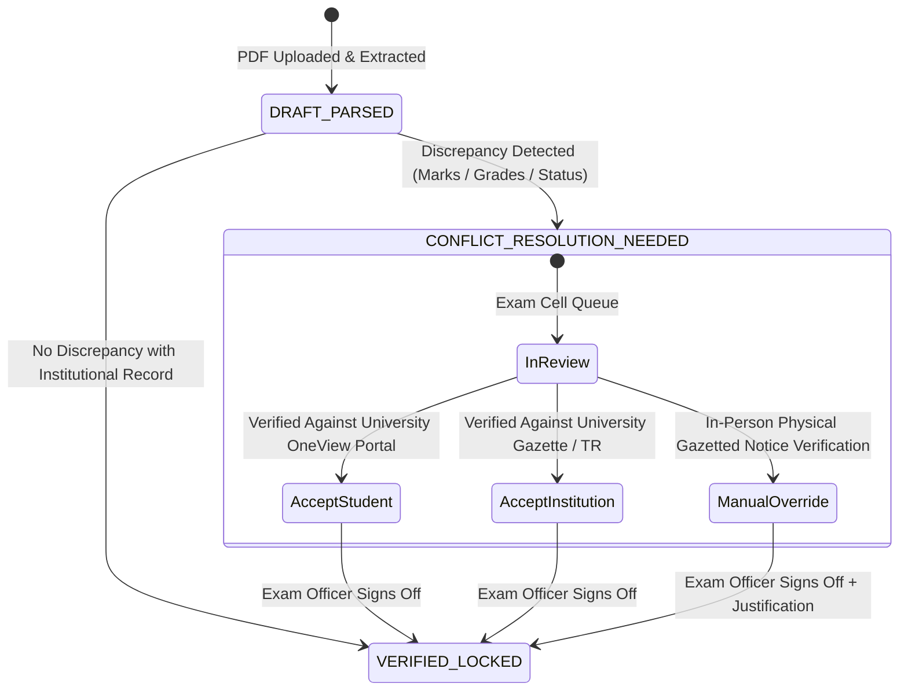

# ADR-0006: Affiliating University (AKTU) Result Ingestion, PDF Parsing & Immutable Marks Revision Ledger

* **Status:** Accepted / Locked
* **Date:** 2026-09-21
* **Deciders:** Developer, Yogesh

---

## Context

In an affiliating college structure (such as colleges affiliated with Dr. A.P.J. Abdul Kalam Technical University — AKTU, UP), the collegiate institution conducts internal sessional assessments, but semester-end examinations, external paper evaluations, grading, and degree progression are governed externally by the University.

University results are distributed via Tabulation Register (TR / Gazette) PDFs to the college and OneView scorecard PDFs to students. Furthermore, university scores are **non-static** and frequently evolve across a student's academic lifecycle due to:
1. **Challenge Evaluation (Re-evaluation):** Stage 1 (Digital copy review) and Stage 2 (Evaluation by two independent external evaluators) where marks may increase, decrease, or remain unchanged.
2. **Scrutiny / Retotalling:** Administrative verification of arithmetic totaling.
3. **Carry Over Papers (Back Papers / COPs):** Re-appearing in failed subjects in subsequent odd or even semester exam cycles.
4. **Special Carry Over Papers:** Mercy clearance examinations for final-year students.
5. **Grace Marks (PWG — Pass With Grace):** University ordinance awarding up to statutory limit (e.g. 1–7 marks) to clear borderline subjects.
6. **Year Backs (Academic Detention):** Failure to achieve statutory minimum credit thresholds (e.g. 50% year credits) requiring an academic year repeat.

When both students and college administrative cells upload results, discrepancies and fraudulent submissions can occur. Campus OS requires a deterministic PDF ingestion pipeline, an institutional conflict resolution workflow, and a strictly immutable historical revision ledger that tracks **what changed, when, on which uploaded document, and by whom**.

---

## Decision

### 1. Dual-Channel Upload Ingestion Architecture

Results are ingested via two distinct regulatory channels:
1. **Institution Channel (`INSTITUTION_BULK`):**
   * Performed by the College Exam Cell / Registrar's Office.
   * Ingests official university Tabulation Registers (TR / Gazette PDFs) or bulk department result archives.
2. **Student Self-Service Channel (`STUDENT_SELF`):**
   * Students upload their official AKTU OneView / university scorecard PDF downloaded from the university portal.
3. **Evidence Archival:**
   * All uploaded PDFs are hashed (SHA-256) and archived immutably in `document_schema.documents`. No marks are parsed without an associated immutable document record.

### 2. PDF Parsing & Structured Data Extraction Engine

The ingestion pipeline extracts structured data from university PDF formats:
* **Header Metadata:** University Roll Number, Enrollment / PRN Number, Academic Session (e.g. `2024-25`), Semester Number (1–8), Exam Type (`REGULAR`, `BACK_PAPER`, `CHALLENGE_EVALUATION`, etc.).
* **Per-Subject Rows:**
  * Subject Code (e.g. `KCS501`), Subject Name (e.g. `Database Management Systems`), Subject Type (`THEORY` vs. `PRACTICAL`).
  * Internal / Sessional Marks, External / End-Sem Marks, Total Marks, Maximum Marks.
  * Letter Grade (e.g. `A+`, `B`, `F`), Grade Points, Credits Assigned.
  * Grace Marks Awarded (`is_grace_awarded = true`, `grace_marks = X`).
* **Summary Metrics:** SGPA, CGPA (if cumulative), Total Credits Attempted, Total Credits Earned, and University Result Status:
  * `PASS`: Cleared all subjects cleanly.
  * `PWG`: Pass With Grace under university ordinance.
  * `PCP`: Promoted with Carry-over Papers (eligible for next semester but holds active back papers).
  * `FAILED`: Not promoted / failed semester.
  * `YEAR_BACK`: Academic detention due to insufficient cumulative credits.

### 3. Conflict Detection & Institutional Resolution State Machine

When a student upload and an institution upload disagree, or when a new upload contradicts an existing verified baseline:



* **Automated Discrepancy Detection:** A conflict is flagged (`has_conflict = true`, `verification_status = CONFLICT_RESOLUTION_NEEDED`) if any of the following differ across uploads:
  * Any subject internal, external, or total marks.
  * Subject grade or credit award.
  * SGPA or overall result status (`PASS` vs `PWG` vs `PCP` vs `YEAR_BACK`).
* **Side-by-Side Resolution Interface:** The Exam Cell reviews candidate revisions side-by-side with direct PDF viewer access to both evidentiary documents.
* **Audited Decision Record:** The resolving officer selects the authentic version (`RESOLVED_ACCEPTED_STUDENT`, `RESOLVED_ACCEPTED_INSTITUTION`, or `RESOLVED_MANUALLY`) with mandatory text justification.

### 4. Immutable Revision Ledger (What Changed, When, on Which Upload, by Whom)

Marks records are **append-only ledgers**. Existing rows are never overwritten in-place:
* Every upload or revaluation produces a new sequential revision (`revision_number = 1, 2, 3...`) in `academic_schema.university_exam_result_revisions`.
* **Traceability Invariants:**
  * **`upload_source`:** Distinguishes `INSTITUTION_BULK` from `STUDENT_SELF` or `MANUAL_OVERRIDE`.
  * **`document_id`:** Cryptographic link to the exact source PDF in `documents`.
  * **`uploaded_by_user_id`:** Identity of the student or administrator who uploaded the file.
  * **`verified_by_user_id`:** Identity of the Exam Cell officer who verified and locked the revision.
  * **`delta_details` (JSON):** Automatically computed differential snapshot between current and previous revision:
    ```json
    {
      "exam_type": "CHALLENGE_EVALUATION_S2",
      "previous_sgpa": 7.42,
      "new_sgpa": 7.85,
      "status_change": {"from": "PCP", "to": "PASS"},
      "subjects_modified": [
        {
          "subject_code": "KCS501",
          "subject_name": "Database Management Systems",
          "previous_external_marks": 24,
          "new_external_marks": 41,
          "previous_grade": "F",
          "new_grade": "B",
          "delta": 17
        }
      ]
    }
    ```

### 5. Multi-Cycle Examination Progression (Back Papers & Year Backs)

1. **Back Paper (Carry Over Paper - COP) Tracking:**
   * When a student re-appears for a backlog paper in a subsequent semester, the attempt is logged with `is_back_paper = true` and incremented `attempt_number`.
   * The original semester's result history retains the initial failure (`revision 1`), while subsequent revisions reflect cleared backlogs, recalculating SGPA according to university ordinances.
2. **Year Back (Detention) Handling:**
   * If a student fails to accumulate required minimum credits across odd and even semesters, the system transitions their semester status to `YEAR_BACK` and links to `student_schema.student_lifecycle_history` (`SUSPENDED_OR_ON_LEAVE` / `YEAR_BACK`).
   * Upon repeating the academic year, the original failed year ledger remains permanently sealed in the audit chain, and a new academic session ledger is inaugurated.

---

## Consequences

* **Positive:**
  * Resolves collegiate reality where colleges rely on university-issued external scores.
  * Completely prevents marks tampering and fraudulent scorecard claims through cryptographic document linking and dual-channel cross-validation.
  * Forensically audits the entire re-evaluation lifecycle (Challenge Evaluation Stages 1 & 2, Scrutiny, Back Papers, Grace Marks).
  * Automatically surfaces discrepancies to the Exam Cell for institutional resolution.
* **Negative:**
  * Requires robust PDF extraction parsers designed to handle variations in university scorecards and Gazette layouts.
  * Requires Exam Cell administrative capacity to resolve conflicting uploads.
